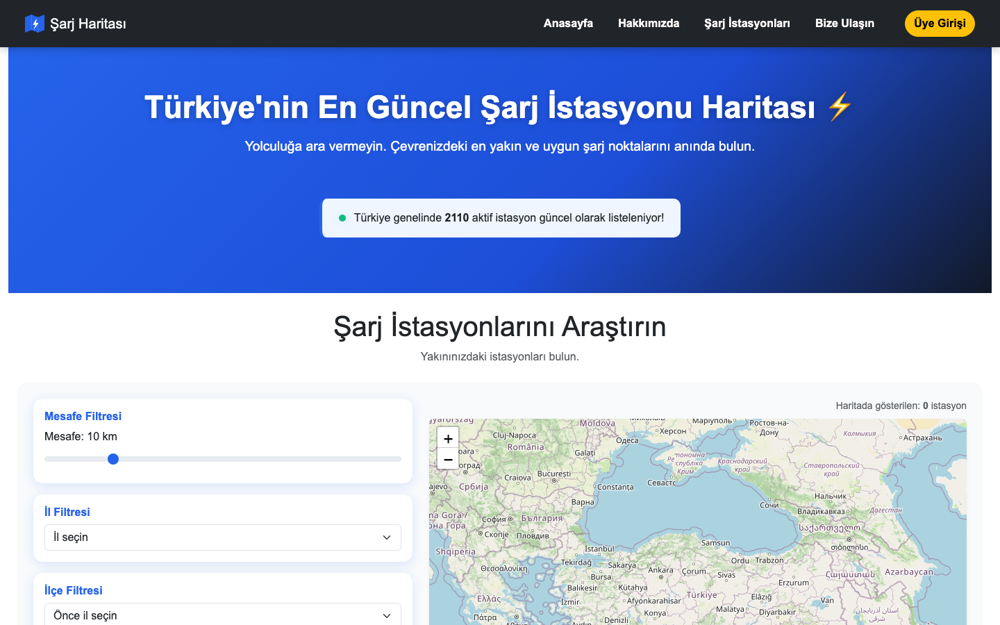
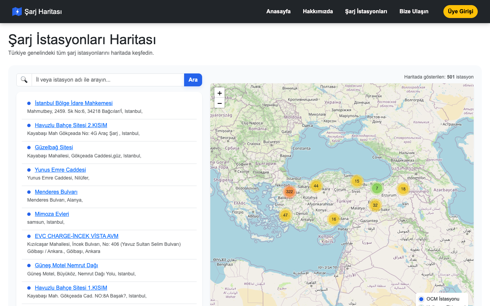

<p align="center">
  
</p>

<h1 align="center">⚡ Şarj Haritası</h1>

<p align="center">
  Türkiye genelindeki elektrikli araç (EV) şarj istasyonlarını tek bir platformda gösteren,
  <a href="https://openchargemap.org/">Open Charge Map API</a> verilerini kullanıcıların eklediği
  istasyonlarla birleştiren bir Ruby on Rails web uygulaması.
</p>

<p align="center">
  
  
</p>

## 📍 Vizyonumuz

Türkiye genelindeki tüm elektrikli araç şarj istasyonlarını tek bir platformda birleştiren, sürücülerin yolculuklarını kesintisiz ve güvenle planlamasını sağlayan lider şarj istasyonu haritası olmak.

## ⚡️ Misyonumuz


EV sürücülerine en güncel, doğru ve anlık istasyon bilgilerini sunarak şarj noktası bulmayı kolaylaştırmak; Türkiye'nin elektrikli araç dönüşümüne ve sürdürülebilir geleceğe hızlı, pratik çözümlerle katkıda bulunmak.

## ✨ Özellikler

- **Harita üzerinde istasyon keşfi** — Open Charge Map API'den gelen istasyonlar ile kullanıcıların eklediği istasyonlar aynı haritada, farklı renklerde (mavi/yeşil) kümelenerek gösterilir
- **Üyelik ve oturum yönetimi** — Rails 8'in yerleşik authentication sistemi ile kayıt ol / giriş yap / şifremi unuttum (mail ile sıfırlama linki)
- **İstasyon ekleme (CRUD)** — giriş yapan kullanıcılar kendi şarj istasyonlarını harita verisine ekleyebilir, düzenleyebilir, silebilir
- **Profil / Panelim** — kullanıcı kendi eklediği istasyonları, favorilerini ve etkileşimlerini tek yerden görür
- **Favoriler** — herhangi bir istasyonu (OCM ya da kullanıcı eklemesi fark etmeksizin) favorilere ekleyip çıkarabilme
- **İstasyon durum bildirimi** — topluluk, bir istasyonun çalışır/arızalı olduğunu bildirebilir; en güncel durum liste ve harita üzerinde rozet olarak gösterilir
- **Beğeni / beğenmeme sistemi** — istasyonlar için topluluk oyu, beğeni-beğenmeme sayaçlarıyla
- **Gelişmiş filtreleme** — mesafe, il ve ilçeye göre filtreleme; "Filtrele" ve "Temizle" butonlarıyla açık kontrol
- **Mesafeye göre arama** — konumunuza göre en yakın istasyonları listeler
- **Duyarlı (responsive) tasarım** — mobil uyumlu navbar, harita ve listeler
- **Kurumsal sayfalar** — Hakkımızda, Bize Ulaşın (mail gönderimli iletişim formu), Hizmet Şartları, Gizlilik ve Hizmet Sözleşmesi, KVKK, Çerez Politikası ve çerez tercihleri yönetimi

## 🛠 Kullanılan Teknolojiler

- **Ruby** 3.3.7 / **Rails** 8.1.3
- **PostgreSQL** — kullanıcı, istasyon, favori, durum bildirimi ve beğeni verileri için
- **Rails 8 built-in Authentication** — `has_secure_password`, session tabanlı giriş
- **Solid Queue / Solid Cache / Solid Cable** — Rails 8'in veritabanı destekli arka plan iş, cache ve realtime altyapısı
- **Action Mailer** — şifre sıfırlama ve iletişim formu bildirimleri
- **Leaflet.js + Leaflet.markercluster** — harita görselleştirme ve istasyon kümeleme
- **Turbo & Stimulus** — sayfa içi etkileşimler (filtre, çerez tercihleri, harita/liste geçişi)
- **Bootstrap 5.3** — grid sistemi, navbar, kart ve modal bileşenleri
- **Importmap** — build adımı olmadan JavaScript bağımlılık yönetimi
- **Open Charge Map API** (`httparty` ile) — genel şarj istasyonu verileri

## 🚀 Kurulum

### Gereksinimler

- Ruby 3.3.7
- PostgreSQL
- Bundler
- Bir [Open Charge Map API](https://openchargemap.org/site/develop/api) anahtarı

### Adımlar

1. Depoyu klonlayın:

   ```bash
   git clone https://github.com/Farukpolat1/open-charge-map.git
   cd open-charge-map
   ```

2. Gerekli gem'leri yükleyin:

   ```bash
   bundle install
   ```

3. Ortam değişkenlerini ayarlayın (proje kök dizininde `.env`):

   ```
   OPEN_CHARGE_MAP_API_KEY=buraya_api_anahtarinizi_yazin
   ```

4. Veritabanını hazırlayın:

   ```bash
   bin/rails db:create db:migrate
   ```

5. Sunucuyu başlatın:

   ```bash
   bin/rails server
   ```

6. Tarayıcınızda açın:

   ```
   http://localhost:3000
   ```

### Testleri çalıştırma

```bash
bin/rails test
```

## 📁 Proje Yapısı (özet)

```
app/
  controllers/        # sessions, registrations, passwords, profiles,
                       # stations, favorites, status_reports, station_ratings, pages
  models/              # user, session, station, favorite, status_report, station_rating
  javascript/
    controllers/       # Stimulus controller'ları (map-toggle, location-filter, cookie-preferences)
    station_markers.js       # harita marker/kümeleme mantığı
    station_detail_panel.js  # istasyon detay panel render'ı
  mailers/             # passwords_mailer
  views/
    stations/          # istasyon listeleme, detay, ekleme/düzenleme formları
    profiles/          # kullanıcı paneli
    pages/              # anasayfa, hakkımızda, iletişim, yasal sayfalar
  assets/stylesheets/   # tema değişkenleri (:root custom properties) ve bileşen stilleri
docs/screenshots/       # README görselleri
```

## 🔑 Open Charge Map API Anahtarı Alma

1. [openchargemap.org](https://openchargemap.org/site/develop/api) adresine gidin.
2. Ücretsiz bir hesap oluşturun.
3. API anahtarınızı alın ve yukarıdaki `.env` dosyasına ekleyin.

## 🙏 Teşekkür Ederiz

Yolculuğunuzda bizi tercih ettiğiniz ve haritamızı kullandığınız için teşekkür ederiz. Elektrikli araç deneyiminizi kolaylaştırmak için her zaman yanınızdayız.

---

© 2026 Şarj Haritası — Tüm Hakları Saklıdır.

--------------------------------------------------------------------------------------------------------------------------------------------------------------------------ENGLISH---------------------------------------------------------------------------------------------------------------------------------------------------

<h1 align="center">⚡ Şarj Haritası (Charge Map)</h1>

<p align="center">
  A Ruby on Rails web application that displays electric vehicle (EV) charging stations across
  Turkey on an interactive map, combining <a href="https://openchargemap.org/">Open Charge Map API</a>
  data with stations added directly by users.
</p>

## 📍 Our Vision

To become the leading charging station map by unifying all EV charging stations across Turkey on a single platform, enabling drivers to plan their journeys seamlessly and with confidence.

## ⚡️ Our Mission

To make finding charging points easier for EV drivers by providing the most up-to-date, accurate, and real-time station information — contributing to Turkey's EV transition with fast, practical solutions for a sustainable future.

## ✨ Features

- **Map-based station discovery** — Open Charge Map stations and user-submitted stations rendered together, color-coded and clustered
- **Authentication** — sign up / sign in / password reset via email, built on Rails 8's built-in authentication
- **Station CRUD** — signed-in users can add, edit, and delete their own charging stations
- **Profile / dashboard** — users see their own stations, favorites, and community activity in one place
- **Favorites** — favorite/unfavorite any station, whether from OCM or user-submitted
- **Station status reports** — the community can report a station as working/broken; the latest status shows as a badge on the list and map
- **Like / dislike system** — community voting on stations
- **Advanced filtering** — distance, province, and district filters with explicit "Apply" and "Clear" controls
- **Distance-based search** — find the nearest stations to your location
- **Responsive design** — mobile-friendly navbar, map, and lists
- **Company pages** — About, Contact (with an email-delivering contact form), Terms of Service, Privacy Policy, KVKK (Turkish data protection law), Cookie Policy, and cookie preference management

## 🛠 Tech Stack

- **Ruby** 3.3.7 / **Rails** 8.1.3
- **PostgreSQL** — for users, stations, favorites, status reports, and ratings
- **Rails 8 built-in Authentication** — `has_secure_password`, session-based login
- **Solid Queue / Solid Cache / Solid Cable** — Rails 8's database-backed background jobs, caching, and realtime infrastructure
- **Action Mailer** — password resets and contact form notifications
- **Leaflet.js + Leaflet.markercluster** — map rendering and station clustering
- **Turbo & Stimulus** — in-page interactivity (filters, cookie preferences, map/list toggling)
- **Bootstrap 5.3** — grid system, navbar, card and modal components
- **Importmap** — JavaScript dependency management without a build step
- **Open Charge Map API** (via `httparty`) — public charging station data

## 🚀 Getting Started

### Prerequisites

- Ruby 3.3.7
- PostgreSQL
- Bundler
- An [Open Charge Map API](https://openchargemap.org/site/develop/api) key

### Setup

1. Clone the repository:

   ```bash
   git clone https://github.com/Farukpolat1/open-charge-map.git
   cd open-charge-map
   ```

2. Install the required gems:

   ```bash
   bundle install
   ```

3. Set up environment variables (`.env` in the project root):

   ```
   OPEN_CHARGE_MAP_API_KEY=your_api_key_here
   ```

4. Set up the database:

   ```bash
   bin/rails db:create db:migrate
   ```

5. Start the server:

   ```bash
   bin/rails server
   ```

6. Open in your browser:

   ```
   http://localhost:3000
   ```

### Running tests

```bash
bin/rails test
```

## 📁 Project Structure (overview)

```
app/
  controllers/        # sessions, registrations, passwords, profiles,
                       # stations, favorites, status_reports, station_ratings, pages
  models/              # user, session, station, favorite, status_report, station_rating
  javascript/
    controllers/       # Stimulus controllers (map-toggle, location-filter, cookie-preferences)
    station_markers.js       # map marker/clustering logic
    station_detail_panel.js  # station detail panel rendering
  mailers/             # passwords_mailer
  views/
    stations/          # station listing, detail, add/edit forms
    profiles/          # user dashboard
    pages/              # home, about, contact, legal pages
  assets/stylesheets/   # theme variables (:root custom properties) and component styles
docs/screenshots/       # README images
```

## 🔑 Getting an Open Charge Map API Key

1. Go to [openchargemap.org](https://openchargemap.org/site/develop/api).
2. Create a free account.
3. Get your API key and add it to the `.env` file above.

## 🙏 Thank You

Thank you for choosing us and using our map on your journey. We're always here to make your EV experience easier. Wishing you enjoyable and uninterrupted drives!

---

© 2026 Şarj Haritası — All Rights Reserved.
